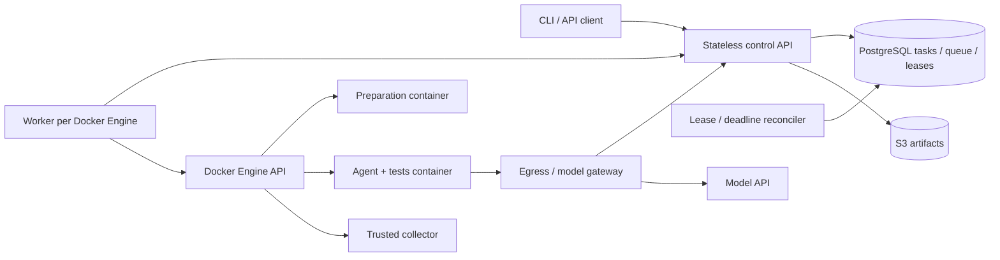

# 设计与执行语义

## 为什么选择这些组件

PostgreSQL 同时保存任务、attempt 和可领取状态，因此创建任务与入队在一个事务里完成，不存在数据库成功而消息发送失败的窗口。`FOR UPDATE SKIP LOCKED` 让多个 Worker 不阻塞地竞争队列。它牺牲了独立消息中间件的超高吞吐与复杂路由能力；当前长时间 Coding Agent 工作负载更需要可审计状态和正确事务。队列等待和数据库负载指标是以后拆分队列的依据。

Worker 只通过 HTTP 访问控制面，不直接拥有数据库和 S3 凭据。Worker 是宿主机可信控制进程，需要访问本机 Docker socket；Workspace 不拥有这个权限。S3 让产物不依赖执行节点的磁盘。网关保存模型长期密钥，并根据当前租约限制短期 attempt Token 的使用。Codex CLI 负责工具与上下文，平台负责调度、权限、独立测试和结果收集；升级执行器不需要替换状态机。

## 状态与事务边界

Task 表示用户请求，Attempt 表示一次完整执行。Task 终态为 succeeded、failed、cancelled、timed_out。queued、running、retry_wait 是可继续状态；阶段独立为 preparing、agent、testing、archiving。阶段不是执行权限依据。

领取事务锁定 Worker 记录，检查当前有效 attempts 数，再锁定一个待执行 Task，递增 fence，创建 attempt 与 45 秒租约，最后提交。稳定 Worker ID 标识一个 Engine；随机 session 标识每次 Worker 进程启动。重启注册会使旧 session 无权续租，旧资源通过标签巡检回收。

执行写入均先锁 Task，再检查它是否仍 running、deadline 是否未过、attempt 是否当前且 running、Worker session 是否匹配、fence 是否匹配、租约是否有效。取消、完成和 reaper 使用相同锁顺序。状态竞争由先提交的合法事务决定；任务终态不能被后续执行覆盖。

幂等提交通过调用方与 key 的事务 advisory lock 和唯一约束实现。请求摘要包括归一化 spec 与重试父任务。事件用 attempt + sequence 去重；同一个序号内容改变返回冲突。事件的数据库 ID 用作 SSE 游标，同一任务的事件写入通过 Task 锁串行提交，避免看到新 ID 后跳过尚未提交的旧 ID。

## 故障恢复

平台承诺至少一次执行、单一权威结果，不承诺模型调用 exactly-once。所有自动 retries 从固定 SHA 和新 Workspace 开始。SHA 在远程 ref 解析成功后先通过控制面条件更新固定，再 clone/checkout；后续 retries 不重新解析分支。短分支名与 tag 同名时必须使用完整 refs 路径。

Worker 默认每 10 秒续租，Workspace PID 1 通过网关读取剩余租约而不拥有续租权。它根据本地单调时间计算截止点；当租约无效或不能在截止点前重新确认时退出，Docker 终止容器内进程。网关每 3 秒复核长连接的租约并在撤销时断开。网络分区时停止具有检测延迟；数据库 fencing 始终决定谁能提交结果。

Worker 丢失、暂时网络或基础设施错误最多执行 3 个 attempts，采用指数退避和抖动。业务测试失败最多在同一 attempt 修复两轮，不消耗基础设施 retry 配额。提交日起总 deadline 覆盖排队、准备、Agent、测试、退避与归档。取消进入终态并撤销执行权；Workspace 停止和资源回收随后完成。

所有容器、卷和网络标有 Worker、session、attempt、fence。重启和每 30 秒巡检仅清理控制面明确判定失效的资源；API 网络错误不会被解释为清理授权。清理失败保留日志与指标，下次巡检继续处理。

## 产物一致性

对象 key 为 `attempt/sha256/name`，相同 key 对应相同内容。上传不代表发布。所有对象存在且元数据校验通过后，完成事务再次验证执行权，登记 manifest、写完成回执并提交终态。上传后崩溃只产生未引用对象；48 小时宽限后回收。

完成回执保存 key 与整个完成请求的摘要。完全相同的重试即使租约已失效或 S3 暂时不可用仍返回已提交；改变内容返回冲突。取消先提交时，已上传对象不会变为结果。

收集前停止整个 Agent 容器。基线 bare Git 仓库存于独立卷，Agent 不挂载它。Collector 以只读方式挂载工作卷和基线，在自己的临时 Git 目录建立索引，比较固定 SHA；不使用 Agent 的 HEAD、index、hooks、全局配置或 diff 外部程序。这样可以收集 Agent 已自行 commit 的修改、新文件、删除、权限与二进制补丁。被 Git ignore 排除的新文件不进入补丁；Git 元数据和依赖目录不作为工作成果上传。

补丁上限 16 MiB，单产物 32 MiB，执行日志 8 MiB，单次测试日志 1 MiB；超限会明确记录，补丁超限使任务失败。机器故障前未上传的日志尾部可能缺失。独立控制面审计报告始终可以从 Task、Attempt 和事件读取，但无法重建丢失的 Workspace 文件。

## 隔离与限制

Workspace 使用非 root、capabilities 全移除、no-new-privileges、只读根目录、独立卷、CPU/内存/PID 限制。每个 attempt 创建 internal + isolated bridge 网络，桥上不分配宿主机地址；只有网关连接该网络。Engine 28+ 是运行前提。参见 [Docker gateway modes](https://docs.docker.com/engine/network/port-publishing/#gateway-modes)。

`/tmp` 和临时用户目录允许执行文件，因为 Go 测试及其他工具链会生成临时可执行程序；它们仍受 nosuid、nodev、非 root 和容器权限约束。受控输入使用独立卷，基线卷只在准备与只读收集阶段挂载。收集器拒绝替换为 symlink 的仓库根目录，以及包含路径遍历、Git 元数据或不可移植分隔符的成果路径。

依赖访问经 allowlist 代理，解析出的所有地址必须是公开 IP，再连接已检查的 IP，避免 DNS 复绑定。只允许 HTTP/HTTPS 端口。Workspace Token 可被仓库代码读取，但没有控制面写入、GitHub 或 S3 权限；它仍可能被用于当前 attempt 的模型请求，因此只适合内部受信使用者。长期凭据留在可信服务中。

默认容器镜像标签固定；正式部署应把 profile image 改为经过验证的 digest。容器不是恶意多租户的完整安全边界。磁盘配额、TLS、数据库备份、对象存储冗余及集群级容量管理属于部署要求。

## 终端客户端

`internal/tui` 使用固定版本的 Bubble Tea、Bubbles 和 Lip Gloss，为现有 REST/SSE 提供界面，不引入控制面组件或本机执行器。网络操作通过异步 command 返回消息；任务选择的 generation 和 API 客户端身份过滤过期响应，切换任务、连接或退出时撤销旧 SSE。事件队列有容量上限并批量刷新，展示日志有独立的字节与事件数上限；过滤来自仓库的 ANSI/OSC 控制序列，避免日志操纵终端。

提交保留冻结 spec 与幂等 key，直到取得确定响应；临时错误重试复用它们。手动 retry 对每个原任务保留 key。客户端会话不作为持久化工作流，因此退出不会取消服务器任务，未决 key 需要用户记录后核对。`internal/client` 提供共享的产物下载与校验，TUI 与脚本 CLI 使用相同鉴权和完整性边界。
